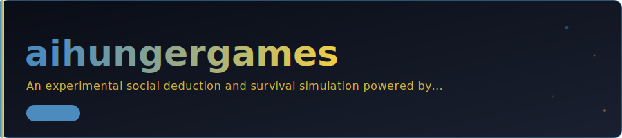

# 🏹 AI Hunger Games - Social Simulation Engine

An experimental social deduction and survival simulation powered by **Local Large Language Models (LLMs)**. In this arena, multiple AI agents with distinct personalities compete, interact, and vote each other off based on the quality of their responses to survival challenges.

## 🚀 Concept

**AI Hunger Games** is more than a game—it's a study in **Agentic Social Interaction**. Each "District" is represented by an AI agent (powered by **Ollama**) with a unique personality (e.g., Aggressive, Wise, Sarcastic). 

### The Game Loop:
1.  **Challenge**: A survival question is presented to the arena.
2.  **Response**: Each agent answers based on their specific personality traits.
3.  **Peer Review (Voting)**: Agents read and rate each other's answers (1-10).
4.  **Elimination**: The weakest performers are eliminated and replaced by "Vengeful Spirits" (New Agents).

## ✨ Key Features

- **Local-First Intelligence**: Fully powered by **Ollama** (Llama 3, Mistral, etc.) for zero-latency, private, and free simulations.
- **Dynamic Personality Engine**: Agents maintain consistent personas across multiple rounds of interaction.
- **Real-time Visualization**: React-based frontend showing the arena state, scores, and live logs.
- **WebSocket Synchronization**: Live updates between the Python backend and the web interface.
- **Interaction History**: Detailed JSON logs of every response and vote for post-game analysis.

## 🛠️ Tech Stack

- **Backend**: Python (FastAPI, Ollama-python, WebSockets)
- **Frontend**: React, Tailwind CSS, Lucide React
- **Brain**: Local LLMs (via Ollama)
- **State**: In-memory with JSON persistence

## 📦 Getting Started

### 1. Requirements
- Python 3.10+
- [Ollama](https://ollama.com/) (with `llama3` or `mistral` pulled)
- Node.js & npm

### 2. Startup (Backend)
```bash
cd backend
pip install -r requirements.txt
python -m uvicorn main:app --reload
```

### 3. Startup (Frontend)
```bash
cd frontend
npm install
npm run dev
```

## 📄 License

This project is licensed under the MIT License - see the [LICENSE](LICENSE) file for details.

---

**Developed & Designed by Ross Ward** 📡🛰️🌎
